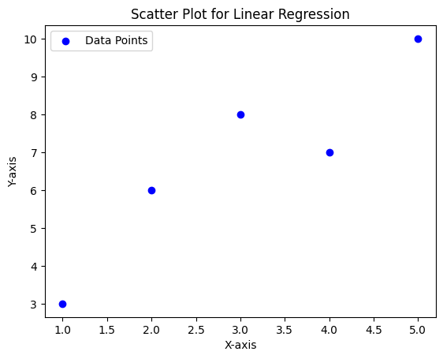

## Dataset

Imagine we have the following dataset:

|  X  |  Y  |
| --- | --- |
|  1  |  3  |
|  2  |  6  |
|  3  |  8  |
|  4  |  7  |
|  5  |  10 |

## Overview of Linear Regression

In short, with linear regression, we try to **best fit** a **linear line** to the dataset, so that we can use that line to predict the output whenever new data comes in, the best way possible.

## Mathematical Details

### Defining the straight line and cost function

The equation of a straight line can be written as:

$$
h_\theta(x) = \theta_0 + \theta_1x
$$

where, $h_\theta(x)$ = Dependent variable 
$\theta_0$ = y-intercept 
$\theta_1$ = slope 
$x$ = Independent variable

"Placeholder for a random linear line fitted into dataset"

We start off with a random line ( random values of $\theta_0$ and $\theta_1$). In order to determine how our _random_ line is performing we define a function, also known as the **cost function**, as follows:

$$
J(\theta_0,\theta_1) = (1/2m)\sum_{i=1}^{m}(h_\theta(x^i)-y^i)^2
$$

where, $m$ = Total number of data points 
$y^i$ = Actual value of $y$ for $x^i$ 
$h_\theta(x^i)$ = Predicted value of $y$ for $x^i$

In our [example](#dataset), $m$ = 5 
$x^1$ = 1, $x^2$ = 2, ... , and so on 
$y^1$ = 3, $y^2$ = 6, ... , and so on

### Interpretation of the cost function