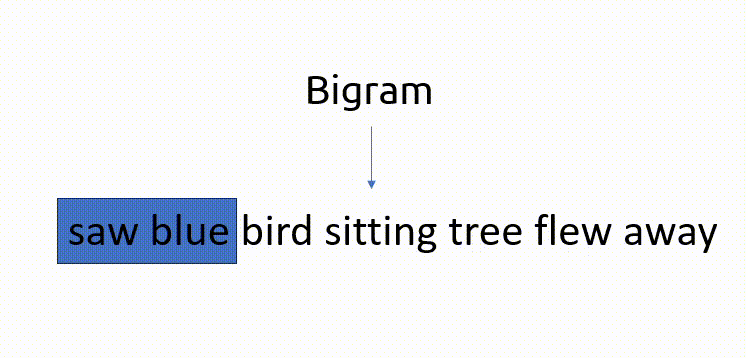

## Bag of Words (BOW)

Let us consider a corpus as follows:

```python
corpus = [
    "I saw a blue bird",
    "The blue bird was sitting on a tree",
    "The blue bird flew away",
]
```
Here, we have three documents:  
D1 -> I saw a blue bird  
D2 -> The blue bird was sitting on a tree  
D3 -> The blue bird flew away

### Preprocessing: Removing stopwords

After removing the stopwords, our documents will be:  
D1 -> saw blue bird  
D2 -> blue bird sitting tree  
D3 -> blue bird flew away

---
> **Note**

To keep things simple, we did not apply other pre-processing techniques such as lowering, stemming or lemmatization. Only stopwords was applied to lower vocabulary size for easier explaination and understanding.

---

### Step 1: Determine vocabulary

Our vocabulary from these three documents will be:

```
['saw', 'blue', 'bird', 'sitting', 'tree', 'flew', 'away']
```

### Step 2: Calculating Frequency

To vectorize our documents, all we have to do is count how many times each word (we call them features) appears

|          Document        |  saw  | blue | bird | sitting | tree | flew | away |
| ------------------------ | ----- | ---- | ---- | ------- | ---- | ---- | ---- |
|  saw blue bird           |   1   |   1  |   1  |    0    |   0  |   0  |   0  |
|  blue bird sitting tree  |   0   |   1  |   1  |    1    |   1  |   0  |   0  |
|  blue bird flew away     |   0   |   1  |   1  |    0    |   0  |   1  |   1  |

We, thus, have our vectors of length 7 for each document as follows:

D1 -> [1, 1, 1, 0, 0, 0, 0]  
D2 -> [0, 1, 1, 1, 1, 0, 0]  
D3 -> [0, 1, 1, 0, 0, 1, 1]  

### Binary Bag of Words (BOW)

Suppose we have a slightly modified corpus and our D1 as one more word 'blue' in it:

D1 -> saw blue bird blue    
D2 -> blue bird sitting tree    
D3 -> blue bird flew away

Applying BOW to the above will give us the following vectors:

D1 -> [1, 2, 1, 0, 0, 0, 0]  
D2 -> [0, 1, 1, 1, 1, 0, 0]  
D3 -> [0, 1, 1, 0, 0, 1, 1]  

For Binary BOW, even if a word occurs more than once in our vocabulary, the count remain as 1:

D1 -> [1, 1, 1, 0, 0, 0, 0]  
D2 -> [0, 1, 1, 1, 1, 0, 0]  
D3 -> [0, 1, 1, 0, 0, 1, 1]

### Advantages

* Simple and intuitive - The strength of BOW lies in it's simplicity, which can be used in tasks like Text Classification

### Disadvantages

* Creates sparse matrices - although better than OHE, the computational complexity doesn't improve that much
* Out of Vocabulary issue persists
* Semantic meaning is still not captured


### Example Code

```python
from sklearn.feature_extraction.text import CountVectorizer

# Define the corpus
corpus = [
    "saw blue bird",
    "blue bird sitting tree",
    "blue bird flew away",
]

# Create an instance of CountVectorizer
vectorizer = CountVectorizer(binary=True) # This parameter generates Binary BOW, default is False

# Fit and transform the corpus to obtain the bag-of-words representation
bow_matrix = vectorizer.fit_transform(corpus)

# Get the feature names (words) from the vectorizer
feature_names = vectorizer.get_feature_names_out()

# Convert the bag-of-words matrix to a dense array for easier visualization
dense_bow_matrix = bow_matrix.toarray()

# Display the bag-of-words matrix
print("Bag-of-Words Matrix:")
print(dense_bow_matrix)

# Display the feature names
print("\nFeature Names:")
print(feature_names)
```

**Output**

```
 Bag-of-Words Matrix:
 [[0 1 1 0 1 0 0]
  [0 1 1 0 0 1 1]
  [1 1 1 1 0 0 0]]

 Feature Names:
 ['away' 'bird' 'blue' 'flew' 'saw' 'sitting' 'tree']
```

---
> **Note**

The features might seem to be appearing at random. This is because, CountVectorizer arranges the features in alphabetical order. 

---

One can also set the maximum number of features to be considered. Setting the parameter 'max_features' ensures consideration of top 'max_features' ordered by term frequency (more on that in the next chapter) across the corpus. Otherwise, all features are used.

```python
vectorizer = CountVectorizer(max_features=3)
```

**Output**
```
 Bag-of-Words Matrix:
 [[0 1 1]
  [0 1 1]
  [1 1 1]]

 Feature Names:
 ['away' 'bird' 'blue']
```
It might also be helpful to figure out the index of the features, which can be done as follows:

```python
vectorizer.vocabulary_
```

**Output**
```
 {'saw': 4, 'blue': 2, 'bird': 1, 'sitting': 5, 'tree': 6, 'flew': 3, 'away': 0}
```

## N-grams

With n-grams, we start considering combination of features. They are basically a set of co-occurring words within a given window and when computing the n-grams you typically move one word forward (although you can move X words forward in more advanced scenarios).

Below is an example of bigram:



Similarly, for trigram, we consider three co-occuring words and so on.

N-gram is used to consider words in their real order so we can get an idea about the context of the particular word

### Step 1: Determine Vocabulary

From our [example corpus above](#preprocessing-removing-stopwords), applying bigram and re-creating the vocabulary would give us

```
['saw', 'blue', 'bird', 'sitting', 'tree', 'flew', 'away', 'saw blue', 'blue bird', 'bird sitting', 'sitting tree', 'tree flew', 'flew away']
```

### Step 2: Calculating Frequency

Similar to how we calculated [the frequency before](#step-2-calculating-frequency)

|          Document        |  saw  | blue | bird | sitting | tree | flew | away | saw blue | blue bird | bird sitting |
| ------------------------ | ----- | ---- | ---- | ------- | ---- | ---- | ---- | -------- | --------- | ------------ |
|  saw blue bird           |   1   |   1  |   1  |    0    |   0  |   0  |   0  |    1     |     1     |       0      |
|  blue bird sitting tree  |   0   |   1  |   1  |    1    |   1  |   0  |   0  |    0     |     1     |       1      |
|  blue bird flew away     |   0   |   1  |   1  |    0    |   0  |   1  |   1  |    0     |     1     |       0      |

---
> **Note**

The other bigrams are not here due to lack of space :(

---

And our vectors for each document will be:

D1 -> [1, 1, 1, 0, 0, 0, 0, 1, 1, 0, 0, 0, 0]  
D2 -> [0, 1, 1, 1, 1, 0, 0, 0, 1, 1, 1, 0, 0]  
D3 -> [0, 1, 1, 0, 0, 1, 1, 0, 1, 0, 0, 0, 1]

### Advantages

* Semantic meaning is somewhat captured

### Disadvantages

* Increases the sparsity of the matrix

### Example Code

We can apply n-grams to our [above code](#example-code) by adding a parameter 'ngram_range=(1,3)' to the CountVectorizer:

```python
vectorizer = CountVectorizer(ngram_range=(1,3))
```

**Output**
```
 Bag-of-Words Matrix:
 [[0 1 0 0 0 0 1 1 0 0 0 0 1 1 1 0 0 0]
  [0 1 0 0 1 1 1 1 0 1 0 0 0 0 0 1 1 1]
  [1 1 1 1 0 0 1 1 1 0 1 1 0 0 0 0 0 0]]

 Feature Names:
 ['away' 'bird' 'bird flew' 'bird flew away' 'bird sitting'
  'bird sitting tree' 'blue' 'blue bird' 'blue bird flew'
  'blue bird sitting' 'flew' 'flew away' 'saw' 'saw blue' 'saw blue bird'
  'sitting' 'sitting tree' 'tree']
```

---
> **Note**

Notice how features are selected from single words, bigrams and trigrams. Defining ngram_range as 'ngram_range=(2,2)' will only consider bigrams and 'ngram_range=(3,3)' will only consider trigrams and so on

---